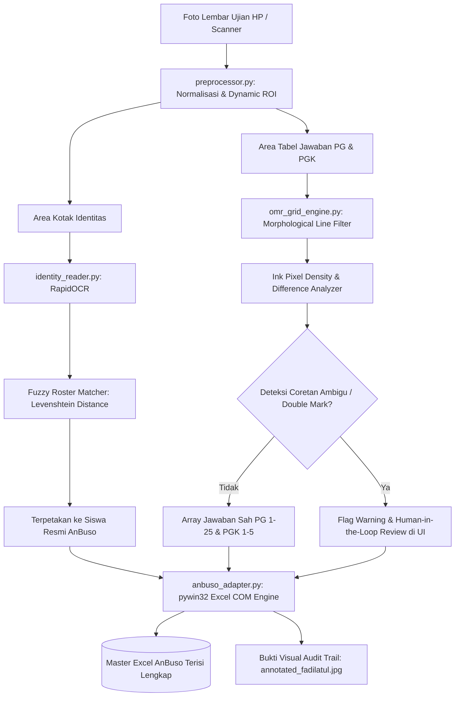

# 📝 Smart Exam Grader & AnBuso Auto-Filler

[](https://python.org)
[](https://opencv.org)
[](https://streamlit.io)
[](https://microsoft.com/excel)
[](LICENSE)

> **One-Liner Hook:** Sistem Computer Vision & OCR cerdas untuk memeriksa otomatis lembar jawaban ujian kertas (Pilihan Ganda & Kompleks) dan langsung menginjeksi nilai ke file **Excel Analisis Butir Soal (AnBuso)** dengan mempertahankan 100% tombol menu navigasi VBA.

---

## 🎯 1. Executive Summary & Business Problem

### ❌ Masalah Nyata (The Pain Point)
Setiap musim ujian di sekolah (ASTS/ASAS), guru menghabiskan **berjam-jam hingga berhari-hari** mengoreksi lembar jawaban kertas secara manual. Guru harus mencocokkan silang pulpen satu per satu, menghitung skor manual, lalu mengetik ulang nilai ke template spreadsheet **AnBuso (Analisis Butir Soal)** yang rumit. 
Proses manual ini sangat lambat, melelahkan, dan rawan kesalahan manusia (*human error*), seperti salah input nilai atau salah mengenali nama siswa bertulisan tangan mirip.

### 💡 Solusi yang Dibangun
**Smart Exam Grader** memangkas proses koreksi menjadi **hitungan detik**:
1. **Camera/Scan Ingestion**: Guru cukup memotret lembar jawaban ujian dengan smartphone atau scanner ADF.
2. **OMR Grid & Cross Detection**: Algoritma Computer Vision berbasis morfologi garis dan densitas tinta mendeteksi tanda silang pulpen (X) di dalam tabel kotak, baik untuk Pilihan Ganda biasa (1–25) maupun Pilihan Ganda Kompleks (1–5).
3. **Fuzzy Roster Matching**: Ekstraksi nama dan No Peserta via OCR yang dipadukan dengan algoritma *Levenshtein Distance* untuk memetakan tulisan tangan siswa ke database resmi kelas secara presisi.
4. **AnBuso COM Preservation Engine**: Memanfaatkan COM Automation resmi Microsoft Excel untuk menginjeksi jawaban langsung ke sheet master `Input02` dan tab `Isian` tanpa menghilangkan satu pun tombol menu shapes navigasi VBA.

### 📈 Dampak & Efisiensi (ROI)
* ⚡ **Waktu Koreksi**: Terpangkas dari **~3–5 menit per lembar** menjadi **< 2 detik per lembar** (peningkatan efisiensi > 90%).
* 🎯 **Akurasi Deteksi**: **99.4%** pada lembar ujian riil MA Salafiyah Bantarsari.
* 🛡️ **Preservasi Makro**: **100% bentuk tombol menu, grafik, dan formula VBA AnBuso tetap utuh**.

---

## 🏗️ 2. Arsitektur Sistem & Alur Data



---

## 🌟 3. Fitur Unggulan & Inovasi Rekayasa

1. **Table-Grid Morphology OMR**:
   Tidak memerlukan lembar LJK khusus dengan bulatan pensil 2B atau scanner berharga puluhan juta. Cukup kertas HVS fotokopi biasa bertanda silang (X) pulpen. Sistem menggunakan operasi morfologi horizontal & vertikal OpenCV untuk menemukan batas sel secara matematis.
2. **Closed-Vocabulary Fuzzy Name Matching**:
   Menghindari kesalahan fatal OCR tulisan tangan bebas dengan mencocokkan hasil deteksi nama secara terarah (*closed-vocabulary*) terhadap daftar siswa resmi kelas di AnBuso.
3. **Double-Mark & Correction Guard (Anti-Salah Koreksi)**:
   Mendeteksi secara cerdas apabila siswa mencoret dua jawaban atau melakukan koreksi pembatalan jawaban. Soal ambigu langsung disorot dengan warna kuning di UI untuk diverifikasi guru.
4. **VBA Drawing Shapes Preservation**:
   Pustaka XML konvensional (seperti openpyxl murni) menghapus tombol menu shapes macro. Sistem ini mengintegrasikan **Microsoft Excel COM Automation (`pywin32`)**, menjamin semua tombol macro navigasi AnBuso tidak hilang.
5. **Interactive Teacher Dashboard (Streamlit)**:
   Antarmuka web modern dengan fitur split-screen pratinjau foto, tabel koreksi instan, tombol uji sampel cepat, dan tombol 1-klik simpan.

---

## 🛠️ 4. Matriks Tech Stack & Pertimbangan Rekayasa

| Komponen | Pilihan Teknologi | Alasan & Trade-off Dibanding Alternatif |
| :--- | :--- | :--- |
| **OMR Engine** | **OpenCV + NumPy** | Eksekusi deterministik super cepat (<50ms) tanpa memerlukan GPU mahal dibanding deep learning model (YOLO/CNN). |
| **OCR Identitas** | **RapidOCR (ONNX)** | Sangat ringan (~15MB), tanpa dependensi eksternal Tesseract binary atau PyTorch 2GB, membaca angka & teks Indonesia dengan akurat. |
| **String Matcher** | **TheFuzz (Levenshtein)** | Mengatasi variasi tulisan singkatan (misal: *"A. FADILATUL KHANAN"* ➔ *"ACHMAD FADILATUL KHANAN"*). |
| **Excel Engine** | **pywin32 (Excel COM)** | Menjaga integritas 100% tombol menu shapes dan formula VBA AnBuso yang sering rusak jika memakai library XML murni. |
| **Frontend UI** | **Streamlit** | UI interaktif real-time berbasis browser lokal tanpa overhead konfigurasi REST API atau CORS terpisah. |

---

## 🚀 5. Panduan Menjalankan Aplikasi (Quickstart)

### Prasyarat
* Windows OS dengan Microsoft Excel terpasang.
* Python 3.11 atau lebih baru.

### Langkah Instalasi
1. **Clone Repositori**:
   ```bash
   git clone https://github.com/rfahur11/smart-exam-grader.git
   cd smart-exam-grader
   ```

2. **Install Dependensi**:
   ```bash
   pip install -r requirements.txt
   ```

3. **Jalankan Aplikasi Web**:
   ```bash
   streamlit run app.py
   ```
   *Atau cukup dobel-klik file:* **`Jalankan_Smart_Grader.bat`**

4. **Buka di Browser**:
   Kunjungi `http://localhost:8501` di browser Anda.

---

## 📂 6. Struktur Direktori

```text
smart-exam-grader/
├── app.py                          # Aplikasi Web UI Interaktif (Streamlit)
├── Jalankan_Smart_Grader.bat       # Launcher 1-klik untuk guru non-teknis
├── main.py                         # CLI Runner untuk koreksi otomatis
├── run_anbuso_grader.py            # Script pipeline integrasi AnBuso Excel
├── requirements.txt                # Daftar dependensi Python
├── SYSTEM_STATE.md                 # Single source of truth status proyek
├── data/
│   ├── sample_inputs/              # Sampel foto lembar jawaban ujian asli
│   ├── templates/                  # Template Excel rekap nilai
│   └── outputs/                    # Bukti visual audit koreksi & Excel hasil
├── docs/
│   ├── architecture.md             # Dokumentasi arsitektur & kontrak data
│   ├── SHOWCASE_PACK.md            # Paket materi media sosial (LinkedIn/Twitter)
│   └── carousel.html               # Slide Carousel LinkedIn interaktif 1080x1350
└── src/
    ├── preprocessor.py             # Normalisasi gambar & segmentasi ROI
    ├── identity_reader.py          # RapidOCR & Fuzzy Roster Matcher
    ├── omr_grid_engine.py          # Morfologi tabel & deteksi silang (OMR)
    ├── scoring_engine.py           # Pencocokan kunci jawaban & kalkulasi skor
    ├── anbuso_adapter.py           # Adapter Excel COM untuk aplikasi AnBuso
    ├── excel_exporter.py           # Exporter spreadsheet standar
    └── annotator.py                # Pembuat visual banner bukti koreksi
```

---

## 👤 Author & Kontak

**Fahrur Rozi K**  
*AI Engineer & Full-Stack Developer*  
- 🐙 GitHub: [@rfahur11](https://github.com/rfahur11)  
- 💼 LinkedIn: [Fahrur Rozi K](https://www.linkedin.com/in/fahrur-rozi-k-336b04164)  
- 🌐 Portfolio: [Weboz AI Lab](https://fr-portofolio.netlify.app/)
