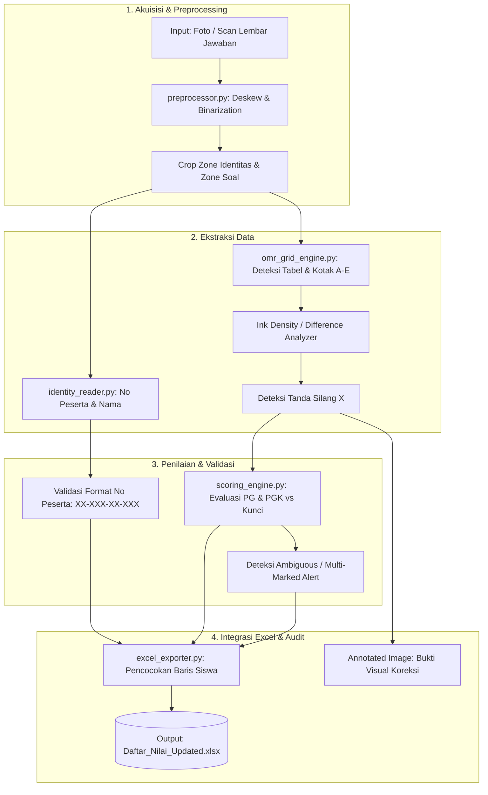

# 📐 Architecture & System Design: Smart Exam Grader

> **Sistem Penilaian Otomatis Lembar Jawaban Kertas Ujian (OMR Grid + OCR) ke Excel**

---

## 1. Flow Diagram (Mermaid)



---

## 2. Component & Code Map Table

| Modul | File Target | Fungsi Utama | Deskripsi |
| :--- | :--- | :--- | :--- |
| **Preprocessor** | `src/preprocessor.py` | `preprocess_image()`, `align_document()` | Mengoreksi orientasi, kontras CLAHE, dan deteksi kontur batas lembar. |
| **Identity Reader** | `src/identity_reader.py` | `extract_identity()`, `parse_student_no()` | Mengekstrak nomor peserta (`09-712-01-091`) dan nama dari kotak kanan atas. |
| **OMR Grid Engine** | `src/omr_grid_engine.py` | `detect_grid_cells()`, `analyze_marked_options()` | Memotong sel kotak A-E pada tabel PG (1-25) dan PGK (1-5), menghitung densitas silang pulpen. |
| **Scoring Engine** | `src/scoring_engine.py` | `grade_exam()`, `calculate_final_score()` | Mencocokkan jawaban terhadap kunci jawaban, menghitung bobot nilai, menandai flag error. |
| **Excel Exporter** | `src/excel_exporter.py` | `export_to_excel()`, `match_student_row()` | Membuka template Excel master, mencari siswa via No Peserta / Nama, mengisi kolom nilai dan catatan. |
| **Main Orchestrator** | `main.py` | `process_exam_sheet()`, `batch_process()` | Titik masuk CLI untuk memproses 1 berkas atau seluruh folder gambar ujian. |

---

## 3. Key Data Contracts (Skema I/O)

### Ekstraksi Lembar Jawaban (`GradingResult`)
```json
{
  "student_info": {
    "student_no": "09-712-01-091",
    "name": "Anindita Kaisha. S",
    "class": "X E4",
    "subject": "Bahasa Inggris"
  },
  "answers_pg": {
    "1": "B",
    "2": "AMBIGUOUS",
    "3": "B",
    "4": "C",
    "5": "B",
    "...": "...",
    "25": "A"
  },
  "answers_pgk": {
    "1": ["A", "C"],
    "2": ["A", "C"],
    "3": ["A", "C"],
    "4": ["A", "D"],
    "5": ["A", "E"]
  },
  "scores": {
    "pg_score": 20,
    "pg_max": 25,
    "pgk_score": 8,
    "pgk_max": 10,
    "total_score": 80.0
  },
  "review_flags": [
    "Nomor 2 memiliki lebih dari 1 tanda silang (butuh verifikasi manual)."
  ]
}
```

---

## 4. Failure Modes & Fallbacks

| Kondisi Gagal | Dampak | Penanganan Otomatis (Fallback) |
| :--- | :--- | :--- |
| **No Peserta tidak terbaca sempurna** | Tidak bisa langsung mapping via ID | Fallback ke pencocokan nama via `thefuzz` (Fuzzy String Matching rasio > 80%). Jika masih gagal, tandai di baris unmapped. |
| **Siswa menyilang 2 opsi (koreksi/coret)** | Nilai salah terhitung | Sistem menandai status `AMBIGUOUS`, skor nomor tersebut di-hold, dan diberi warna kuning di file Excel. |
| **Foto miring / perspektif bergeser** | Grid sel terpotong salah | Dynamic anchor detection menggunakan header tabel ("I. PILIHAN GANDA" dan "II. PILIHAN GANDA KOMPLEKS"). |
